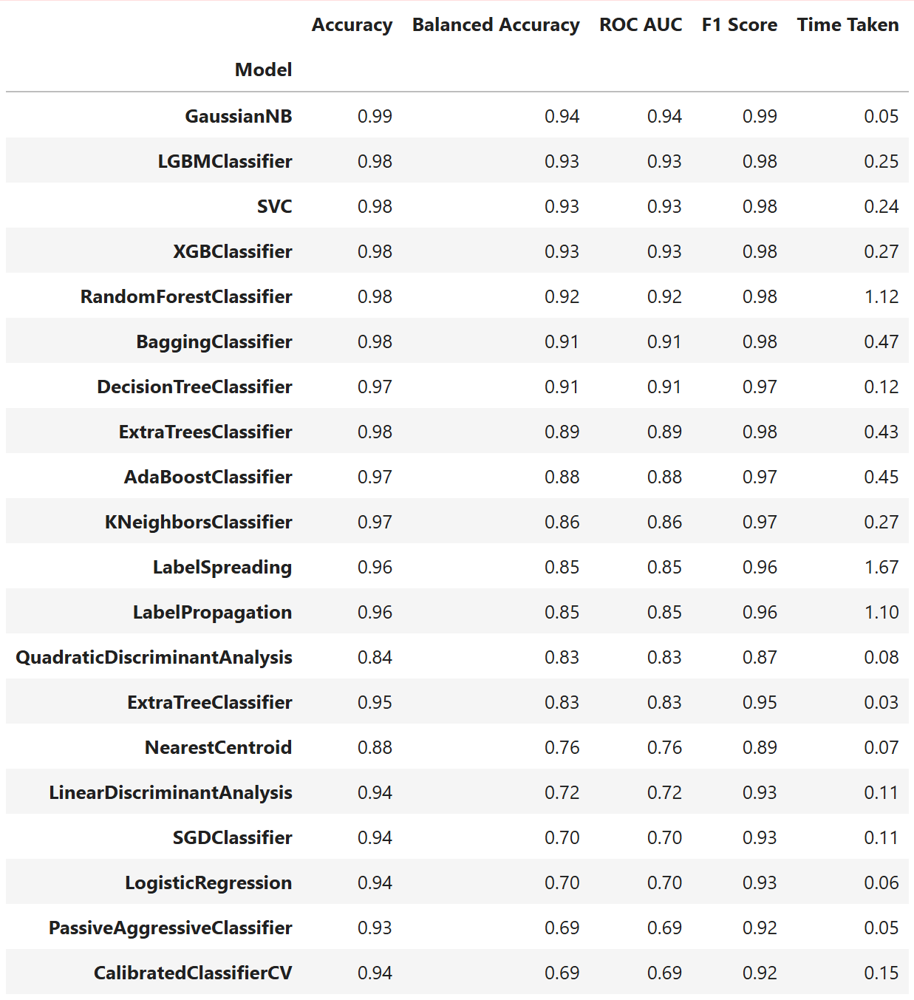
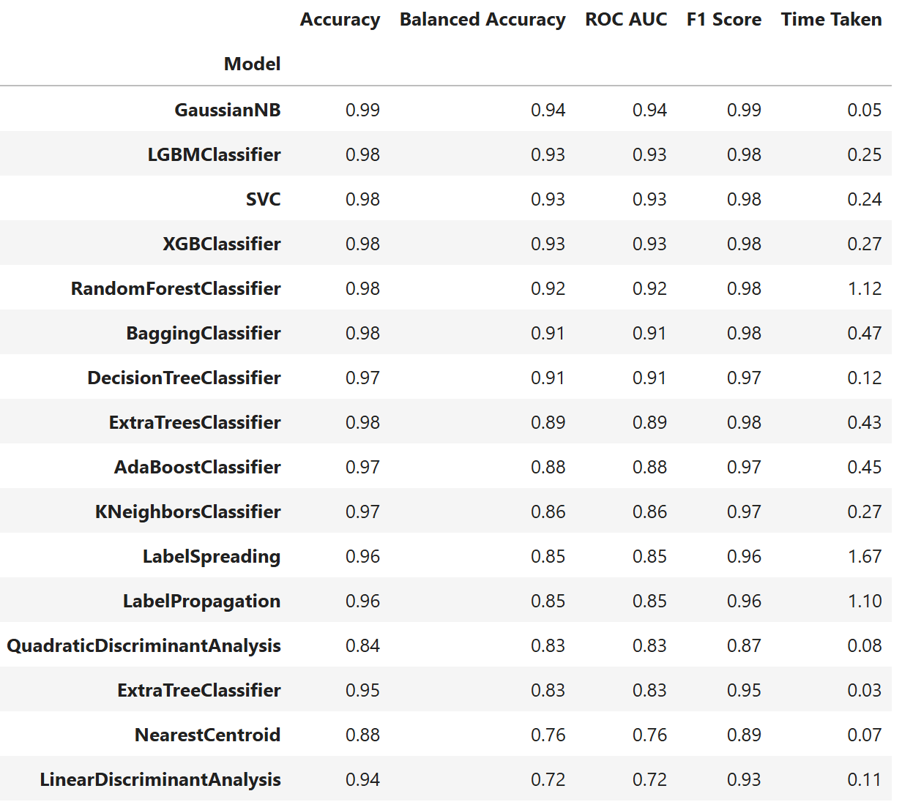

# GNB-equipment-monitoring

## Topic: Developing a classification model to predict faulty machines from a set of operational equipment

> Packages used: Sklearn, Lazy classifier, Pickle, sqlite3

### Goals
- [x] to use lazy predict to find the best model for the data
- [x] link the dataset to sqlite3
- [x] package the model using pickle for a deployable version
- [x] encoding of the non numerical data points 

### Results 
The results of the model with response to the data

Result of the predictions

This shows that the GaussianNB model is the best for this particular dataset
